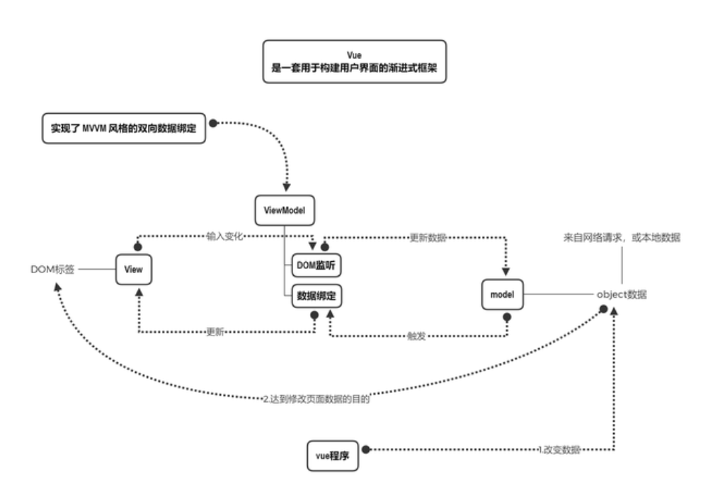

# 一、什么是MVVM？

​		MVVM是Model-View-View Model的简称。其中，View在HTML页面中，model在数据中，即常见的Object。而View model在取出Model的数据的同时可以同时帮忙处理View中由于需要展示内容而涉及的业务逻辑。




# 二、项目介绍		

​		在VUE中，对MVVM的双向绑定和单向绑定实现地很好，可以使用v-model和自带的el字段来实现绑定。本项目实现在不使用VUE等方案的情况下，实现VUE拥有的MVVM功能：

​		主要功能：

​				1.实现数据劫持

​				2.实现发布订阅模式

​				3.实现数据单向绑定

​				4.实现数据双向绑定

​		次要功能：

​				1.使用typescript开发脚本

​				2.有readme.md

​				3.有单元测试，且单元测试覆盖率达到80%

​		考察点：

​				命名、注释、代码组织结构

​				层次性、抽象能力、可扩展性、模块切分、数据封装

# 三、项目结构

​		mvvm

​				dist

​						mvvm_frame

​								**compile.ts**

​								**mvvm.ts**

​								**observer.ts**

​								**watcher.ts**

​								**dep.ts**

​				graph

​						**1.png**

​						**2.png**

​				node_modules

​				src

​						mvvm_frame

​								**compile.js**

​								**mvvm.js**

​								**observer.js**

​								**watcher.js**

​								**dep.js**

​								**test.js（单元测试文件）**

​				**mvvm.html** 

​				**test.html**

​				**package-lock.json**

​				**readme.md**

​				**tsconfig.json**

​				**Typescript笔记 二十分钟快速上手 刘晓旭(自己写的Typescript教程)**

# 四、项目实现

​	1.mvvm.js新建mvvm实例

​	2.compile.js实现数据编译 单向绑定 双向绑定

​	3.observe.js实现数据劫持

​	4.dep.js watcher.js共同实现发布订阅模式

​	5.使用Typescript(√)

​		ts部分共227行，js部分共333行，合计560行

​	6.有readme.md(√)

​		这个就是

​	7.有单元测试，覆盖率达到80%(√)		

```javascript
测试覆盖了
compile.js的全部内容（129 lines）
mvvm.js的全部内容（20 lines）
observer.js的全部内容（40 lines）
五个 .js文件的总行数为 220行 覆盖率达到189/220=85.9% 符合要求
```

​	

